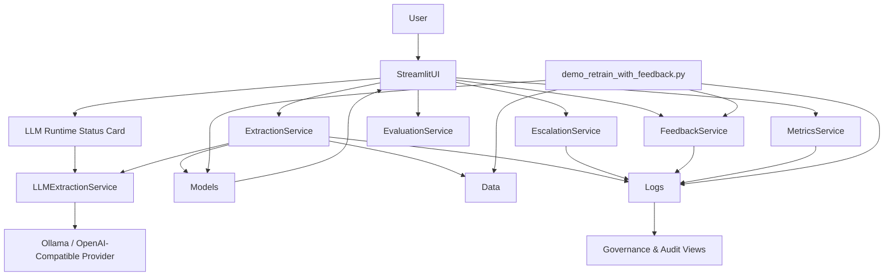
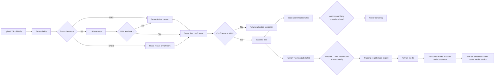
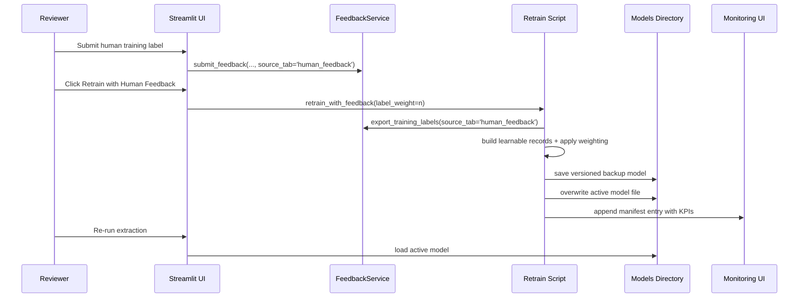

# AI Governance & Evaluation Platform Architecture

## Version: v1.0.0

## Architectural intent

This platform demonstrates an AI-native governed document-intelligence loop where:

1. LLM extraction (or hybrid extraction) produces structured fields,
2. low-confidence results are escalated,
3. human reviewers make operational decisions,
4. separate human training labels are collected,
5. only training-eligible labels flow into retraining,
6. retrained models are versioned, monitored, and auditable.

---

## Primary tabs and responsibilities

- **Extract & Validate** — document upload, AI-native extraction, confidence scoring, escalation triggering
- **Escalation Decisions** — operational HIL review (`approve` / `deny`)
- **Human Training Labels** — source-of-truth labels (`matches_document`, `does_not_match`, `cannot_verify`)
- **Model Monitoring** — pending labels, retrain controls, model version KPIs, baseline reset
- **Governance & Audit** — human label history and escalation decision history

---

## Component diagram

---

## Human-in-the-loop flow

---

## Retraining flow

---

## Key logs and artifacts

- `logs/ai_interactions.csv` — extraction and escalation interaction log
- `logs/hil_actions.csv` — escalation review action log
- `logs/feedback_log.csv` — structured human feedback and training labels
- `logs/retrain_manifest.json` — model version history and KPI history
- `models/field_validation_rf_encoded_model.joblib` — active deployed model
- `models/field_validation_rf_v*_*.joblib` — versioned model backups
- LLM runtime is provider-backed (local Ollama by default in launcher) with status surfaced in UI

---

## KPI philosophy

Primary KPIs:

- **Invalid Recall** — are bad extractions being caught?
- **Macro F1** — is class balance improving or degrading?
- **Escalation Review Rate** — are governance decisions being completed?
- **Pending Label Ratio** — is human feedback waiting to be learned from?

Retrain results are labeled as `Improved`, `Mixed`, `Regressed`, or `Baseline` to avoid overclaiming success.

---

## Demo reset capability

The app includes a baseline reset to restore the active model to **v0.11.1 baseline** so the before/after HIL demo can be replayed reliably.