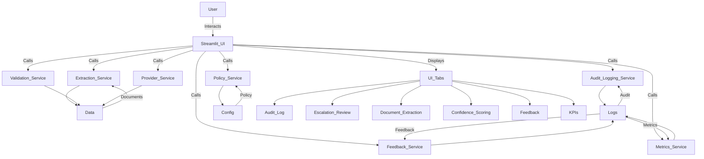

---
# AI Governance & Evaluation Platform Architecture

## Version: v0.9.1

### Key Features

- Modularized business logic into service modules (extraction, validation, audit logging, feedback, file management, metrics, policy, provider)
- Centralized config, data, and logs folders
- Real-time escalation review and human-in-the-loop workflow
- Document extraction, validation, and confidence scoring
- Audit log tab with full review history
- Sequential loan numbering and improved UI/UX
- Feedback logging and summary for continuous improvement
- System Health KPIs for operational visibility
- Streamlit-based modern UI for business users
- Open-source, extensible Python codebase
- Demo Files sidebar expander with download buttons
- Dynamic listing of sample_zips files
- Streamlit download buttons for demo files
- Designed for CTOs, CEOs, hiring managers, and PE operators
...existing code...

## Component Diagram

## Data Flow
- User submits query via UI
- Policy engine evaluates risk and applies controls
- Audit logger records interaction
- Feedback logger captures user feedback
- Metrics module computes KPIs
- All logs are stored in CSV/JSON for compliance and reporting

## Extensibility
- Add new policy rules in `config/policy.yaml`
- Extend feedback logic in `services/feedback_service.py`
- Add new metrics in `services/metrics_service.py`
- UI enhancements via Streamlit components

## Deployment
- Streamlit Cloud, local, or containerized environments
- All processing is local; no data leaves the user's environment